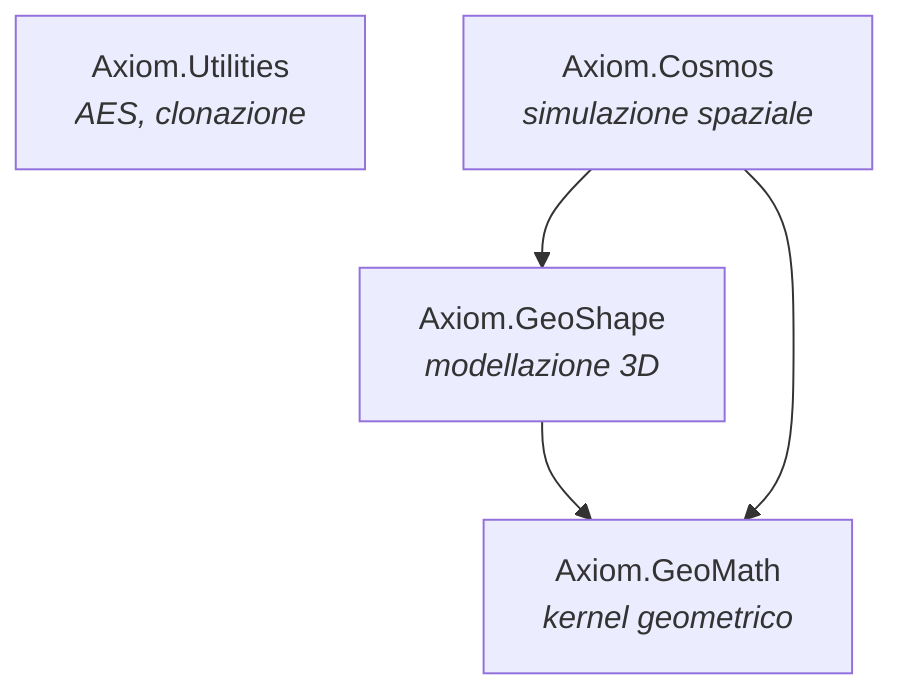

# Axiom Library — Documentazione tecnica approfondita

> Dal greco ἀξίωμα (*axiōma*): «ciò che è degno», «principio accettato come vero».

**Versione libreria:** 2025.11.11 · **Target:** .NET Standard 2.1 (C# 9.0) · **Documento generato dall'analisi del codice sorgente.**

Questo documento parte dai concetti generali e scende progressivamente fino al dettaglio dei
singoli membri, degli algoritmi e dei bug verificati. È organizzato in sei parti:

- **Parte I — Visione d'insieme:** cos'è Axiom, filosofia, stack, dipendenze, build e test.
- **Parte II — Concetti trasversali:** tolleranze, sistemi di riferimento, unità, scene-graph, sistema parametrico, delegate.
- **Parte III — Riferimento dei moduli:** ogni tipo pubblico, membro per membro, con esempi.
- **Parte IV — Algoritmi chiave:** octree/Barnes-Hut, Velocity Verlet, meshing, STL.
- **Parte V — Bug e criticità verificate:** con severità, posizione (`file:riga`), causa, riproduzione e correzione proposta.
- **Parte VI — Stato dei test e appendici.**

---

# Parte I — Visione d'insieme

## 1.1 Cos'è Axiom

Axiom è una soluzione .NET composta da **quattro librerie indipendenti** che formano uno stack a
livelli: dalle utilità di base, al kernel matematico-geometrico, alla modellazione 3D, fino a un
motore di simulazione fisica spaziale. È progettata per essere riutilizzabile sia in applicazioni
**desktop** sia in **Unity** (da cui la scelta di `netstandard2.1` e del linguaggio C# 9.0).

| Progetto | Assembly | Namespace radice | Ruolo | Test |
|---|---|---|---|---|
| **AxiomUtilities** | `Axiom.Utilities` | `Axiom.Utilities` | Utilità generiche (AES, clonazione) | 1 test |
| **GeoMath** | `Axiom.GeoMath` | `Axiom.GeoMath` | Kernel di geometria computazionale | 47 test |
| **GeoShape** | `Axiom.GeoShape` | `Axiom.GeoShape` | Modellazione geometrica 3D | 25 test |
| **Cosmos** | `Axiom.Cosmos` | `Axiom.Cosmos` | Simulazione fisica spaziale n-body + gameplay | 17 test |

## 1.2 Filosofia e stile architetturale

- **Stratificazione netta.** Ogni livello dipende solo da quelli sottostanti; nessuna dipendenza
  circolare. Il kernel (`GeoMath`) non conosce la modellazione (`GeoShape`), che a sua volta non
  conosce l'applicazione (`Cosmos`).
- **Due pilastri di astrazione in GeoShape:** `Curve3D` (tutte le curve) ed `Entity3D` (tutte le
  entità geometriche). Attorno a questi due tipi ruota l'intera modellazione.
- **Estendibilità tramite delegate iniettati.** Il core geometrico non incorpora un valutatore di
  formule né un triangolatore: li riceve dall'esterno **come parametri** (dependency injection) dei
  metodi che ne hanno bisogno. La libreria definisce i *contratti* (i tipi delegate in `Delegates`),
  l'applicazione ospite fornisce le *implementazioni*. *(In passato erano campi statici globali, poi
  rimossi per thread-safety — vedi §2.5.)*
- **Value-oriented con tolleranza.** I confronti geometrici non usano l'uguaglianza esatta ma una
  tolleranza globale (`MathUtils.FineTolerance = 1e-5`).
- **Estensioni come "hub" funzionali.** Molta logica è in classi statiche di extension method
  (`Entity3DExtensions`, `Mesh3DExtensions`, `Figure3DExtensions`, `MathExtensions`): i tipi restano
  contenitori di dati, le operazioni pesanti vivono nelle estensioni.

## 1.3 Grafo delle dipendenze



Dipendenze NuGet: `GeoMath` e `GeoShape` referenziano `System.Text.Json` 10.0.1. `AxiomUtilities` non
ha dipendenze esterne.

> ℹ️ **Namespace bonificati.** Il tipo `AABBox3D` (nel progetto GeoMath) è ora nel namespace
> **`Axiom.GeoMath`** (in precedenza era, in modo anomalo, in `Axiom.GeoShape.Elements`). Analogamente
> `Axiom.Utilities.ObjectExtensions` (prima `AxiomUtilities`) e `Axiom.Cosmos.Starships.ShipFlightController`
> (prima `Assets.AxiomCore.Cosmos_Link.Starships`, retaggio Unity) sono stati riportati al namespace
> coerente col progetto/cartella.

## 1.4 Configurazione, build e test

Le proprietà comuni sono centralizzate in `SharedBuildProps.xml`, importato da
`Directory.Build.props`:

- **Target framework librerie:** `netstandard2.1`
- **Versione linguaggio:** C# `9.0` — *scelta esplicita per la compatibilità con Unity*
- **Nullable:** `enable`, con questi warning nullable soppressi: `CS8600..CS8604, CS8618, CS8625, CS8765`
- **Output centralizzato** nella cartella `Build/` (`Build/obj`, `Build/bin`)
- **Versioni:** `AssemblyVersion = 2025.11.11.<Revision>`
- **Autore/Copyright:** Massimiliano Filanti, © 2025

I progetti di test usano **MSTest** con target più recenti: `net8.0` (GeoMathTest, GeoShapeTest) e
`net10.0` (CosmosTest, AxiomUtilitiesTest).

```bash
# Build completa
dotnet build AxiomLibrary.sln

# Esecuzione test
dotnet test AxiomLibrary.sln
```

Lo script `Clean.bat` rimuove i file `.meta` (residui Unity) e le cartelle `bin`/`obj`.

**Esito test alla data di analisi:** ✅ **90/90 test superati** (GeoMath 47, GeoShape 25, Cosmos 17,
Utilities 1). Vedi [Parte VI](#parte-vi--stato-dei-test-e-appendici).

---

# Parte II — Concetti trasversali

Prima del riferimento per modulo, conviene fissare cinque concetti che ricorrono ovunque.

## 2.1 Tolleranza e confronti

Il default globale è **`MathUtils.FineTolerance = 1e-5`**. Praticamente tutti i metodi `IsEquals`,
`IsOnCurve`, `ApproxEquals`, `Contains` con tolleranza usano questo valore quando non se ne passa uno
esplicito. Anche `Point3D.Equals`/`GetHashCode` sono tolleranti: due punti entro `1e-5` sono
"uguali". Ne consegue che `Point3D` **non è un buon candidato come chiave di dizionario** basata su
hash rigorosi (l'hash tollerante può collidere in modo non intuitivo).

## 2.2 Sistemi di riferimento e trasformazioni

Ogni nodo/entità ha due matrici `RTMatrix` (roto-traslazione 4×4):

- `RTMatrix` — trasformazione **locale**, relativa al padre.
- `ParentRTMatrix` — trasformazione **assoluta del padre**.
- `WorldMatrix` — proprietà **sola lettura** = `ParentRTMatrix × RTMatrix`, cioè la posa nel mondo.

La gerarchia propaga la posa: assegnando `RTMatrix` o `ParentRTMatrix` tramite le rispettive
**proprietà**, il setter ricalcola e propaga `ParentRTMatrix` a tutti i figli (ricorsione). Anche i
setter `X`/`Y`/`Z`/`Translation` ora innescano la stessa propagazione (guardata da `DoRTRecursion`) —
in origine non lo facevano, vedi [BUG-04](#bug-04--la-modifica-di-xyztranslation-non-propaga-ai-figli),
ora corretto.

## 2.3 Unità di misura

- **GeoShape (modellazione):** internamente le lunghezze sono in **millimetri**. I flag
  `ApplyLinearUom` / `ApplyUomFactor` di `Parameter`/`Variable` riguardano **solo la presentazione in
  UI**; il valore memorizzato resta in mm.
- **Cosmos (simulazione):** unità **SI** — metri, chilogrammi, secondi. La costante gravitazionale è
  `G = 6.67430e-11`.
- **Angoli:** le curve e le matrici lavorano internamente in **radianti**; le *formule* di rotazione
  dei nodi/entità (`RotXFormula`…) sono intese in **gradi** e convertite con `MathUtils.DegToRad`.

## 2.4 Scene-graph parametrico

`Node3D` è il contenitore gerarchico: contiene nodi figli (`Nodes`), entità figlie (`Entities`), una
posa locale e le formule. Ogni elemento è indirizzabile per `Path`/`PathId` (albero navigabile per
stringa). `Entity3D` è la base astratta di tutte le entità geometriche concrete. Entrambi condividono
il flusso "formule → valori → matrice".

## 2.5 Il sistema parametrico e i delegate

Nodi ed entità possono definire posizione/rotazione/dimensioni tramite **formule testuali** invece di
valori fissi. Gli attori:

- **`Variable`** — variabile nominata (`Name`, `Value`, `Formula`, `ReadOnly`, `Description`). Se
  `Formula` è non vuota è "secondaria" (dipende da altre).
- **`Parameter`** — parametro geometrico (`Name`, `Value`, `Formula`, `ApplyLinearUom`).
- **Formule di posa** — `XFormula`, `YFormula`, `ZFormula`, `RotXFormula`, `RotYFormula`, `RotZFormula`.
- **`Delegates`** — i **tipi** delegate (punti di innesto verso i motori esterni):

| Delegate | Firma | Scopo |
|---|---|---|
| `EvaluatorDelegate` | `double (Dictionary<string,Variable> vars, string expr, out string err)` | valuta le espressioni |
| `ComputeTriangulationDelegate` | `List<Triangle3D> (Figure3D profile)` | triangola profili chiusi |
| `RayMeshCollision` | `bool (Ray3D ray, Mesh3D mesh)` | collisione raggio-mesh |

> ℹ️ **I delegate si iniettano come parametri** (dependency injection), non sono più stato statico
> globale. In precedenza `Delegates` esponeva i campi statici `DelegateEvaluator` e
> `ComputeTriangulation` (stato mutabile globale, non thread-safe e fonte di flakiness nei test
> paralleli): sono stati **rimossi**.
>
> - **Valutatore di formule:** passato a `Node3D.Update(variables, evaluator, out error)` e
>   `Entity3D.Update(variables, evaluator, out error)` (e `Node3D.UpdateRTMatrix(evaluator)`). Se
>   `evaluator` è `null`, le formule non vengono valutate (i valori restano quelli impostati
>   direttamente); `UpdateRTMatrix()` senza argomenti equivale a evaluator `null`.
> - **Triangolatore:** parametro opzionale `triangulator` (default `null`) dei metodi di meshing che
>   creano superfici di chiusura: `Entity3DExtensions.FromEntity3D/FromExtrusion3D/FromSweepExtrusion3D/
>   FromPlanarFace3D(..., triangulator)` e `Mesh3D.CutByPlane(..., addClosingFace, triangulator)`. Se
>   `null`, le facce di chiusura non vengono generate.

---

# Parte III — Riferimento dei moduli

## 3. Axiom.Utilities

Libreria di utilità generiche, del tutto indipendente dal resto.

### 3.1 `StringExtensions` — crittografia AES-256-GCM (autenticata)

Cifra/decifra stringhe con **AES-256-GCM** (cifratura autenticata). La chiave AES è derivata dalla
passphrase con **PBKDF2** (SHA-256, 100 000 iterazioni, sale casuale), non più con un semplice
padding. Ogni cifratura usa **sale e nonce casuali**, quindi lo stesso testo produce ogni volta un
risultato diverso; il tag GCM garantisce che manomissioni del testo cifrato (o una chiave errata)
vengano rilevate con una `CryptographicException` invece di restituire dati corrotti.

| Metodo | Firma | Descrizione |
|---|---|---|
| `Encrypt` | `string Encrypt(this string plainText, string key)` | Cifra → Base64 di `[salt 16][nonce 12][tag 16][dati]` |
| `Decrypt` | `string Decrypt(this string cipherText, string key)` | Operazione inversa; verifica il tag di autenticazione |

```csharp
using Axiom.Utilities;

string cifrato = "messaggio segreto".Encrypt("la-mia-chiave");
string chiaro  = cifrato.Decrypt("la-mia-chiave");   // -> "messaggio segreto"
```

> ℹ️ **Sicurezza (bonificata):** la chiave è ora derivata con **PBKDF2** (SHA-256, sale casuale) e i
> dati sono protetti con **AES-256-GCM** (autenticazione integrata). Il formato del blob è cambiato
> (`[salt][nonce][tag][ciphertext]`), quindi non è compatibile con i dati cifrati dalla versione
> precedente. Resta adeguato per offuscamento/uso interno; per requisiti forti valutare un fattore di
> lavoro KDF più alto o una passphrase ad alta entropia.

### 3.2 `ObjectExtensions` — clonazione

Come `StringExtensions`, è nel namespace **`Axiom.Utilities`** (in precedenza era `AxiomUtilities`,
incoerenza ora bonificata).

| Metodo | Firma |
|---|---|
| `MakeCopyOf` | `object MakeCopyOf(this object toClone)` |

Logica di `MakeCopyOf`:
1. implementa `ICloneable` → `Clone()`;
2. è `ValueType` → copia per valore;
3. è `List<string>` / `List<int>` / `List<double>` → nuova lista;
4. è `null` → `null`;
5. altrimenti → `throw NotSupportedException("object not cloneable")`.

> Nota: il controllo `toClone == null` è **dopo** i controlli `is`, quindi è di fatto irraggiungibile
> per un `null` (che comunque non entra in nessun `is`). Innocuo, ma indica che il caso null è
> gestito per ultimo e ridondante.

---

## 4. Axiom.GeoMath — il kernel geometrico

Fornisce le primitive numeriche e geometriche di base. **Tolleranza di riferimento:**
`MathUtils.FineTolerance = 1e-5`.

### 4.1 `MathUtils` — costanti e helper (statica)

| Membro | Valore / Firma | Note |
|---|---|---|
| `RadToDeg` | `180 / Math.PI` | costante rad → gradi |
| `DegToRad` | `Math.PI / 180` | costante gradi → rad |
| `FineTolerance` | `0.00001` | tolleranza globale |
| `DegreeToRad(double)` | `a * DegToRad` | |
| `RadToDegree(double)` | `a * RadToDeg` | |
| `Swap<T>(ref T, ref T)` | | scambio generico |

### 4.2 `MathExtensions` — confronti con tolleranza (statica)

Su `double`: `IsEquals(v)` / `IsEquals(v, precision)`, `IsEqualsOrGreater`, `IsEqualsOrLesser` (con
tolleranza opzionale), `AngleToRange02PI()` (normalizza in `[0, 2π)`), `AngleToRange0360()`,
`InternalAngle(a1, a2)` (angolo interno in gradi, sempre positivo), `RoundToString(int decimals)`.
Su `Point3D`: `IsNotNull()`, `IsNull()`.

### 4.3 `Point3D` (readonly struct immutabile)

Punto 3D **immutabile** (`readonly struct`) con semantica di tolleranza: le coordinate non cambiano
dopo la costruzione, ogni operazione restituisce una **nuova** istanza. È un **value type**: non può
essere `null` e viene copiato per valore.

> ⚠️ **Semantica del "punto nullo".** Essendo uno struct, `Point3D` non ammette un costruttore senza
> parametri: **`new Point3D()` è il default `(0,0,0)`**, NON il sentinella NaN (a differenza della
> precedente implementazione a classe). Il sentinella "nullo" è **`Point3D.NullPoint`** `(NaN,NaN,NaN)`,
> verificabile con `IsNan()` / l'estensione `IsNull()`.

**Statici:** `Zero` = `(0,0,0)`, `NullPoint` = `(NaN,NaN,NaN)`, `Negate(p)`.

**Proprietà (sola lettura):** `X`, `Y`, `Z`; `IsAbsolute` (il costruttore 2D lo mette a `false`).

**Costruttori:** `Point3D(x,y,z)` · `Point3D(x,y,z,isAbsolute)` · `Point3D(x,y)` → z=0, non assoluto ·
`Point3D(Point3D)` (copia). *(nessun `Point3D()`: usare `NullPoint` per il sentinella)*

**Metodi "With" (immutabilità):** `WithX(x)`, `WithY(y)`, `WithZ(z)`, `With(x,y,z)`, `WithIsAbsolute(b)`
— restituiscono una copia con la coordinata modificata (es. `p = p.WithX(10)`).

**Altri metodi:** `Distance`, `DistanceSqr`, `IsEquals(Point3D[, tol])`, `AreColinear2D`/`AreColinear3D`,
`IsNan()`, `ToVector()`, `ToString()`.

**Uguaglianza:** `Equals`/`==`/`!=` sono **tolleranti** (value equality). `GetHashCode()` restituisce
un valore **costante** (un'uguaglianza tollerante non è compatibile con un hash discriminante): perciò
`Point3D` NON è adatto come chiave di dizionario/hashset — per indicizzare punti usare una struttura
spaziale (es. `OctreeNode`).

**Operatori:** conversione **implicita** `Vector3D → Point3D`; `==`, `!=`; `+` (`P+P`, `P+V`), `-`
(`P-P→V`, `P-V→P`, unario), `*` (`P*scalar`, `scalar*P`), `/` (`P/scalar`), `>`, `<`.

### 4.4 `Vector3D` (readonly struct immutabile)

Vettore 3D **immutabile** (`readonly struct`) con algebra completa. Come `Point3D` è un value type
(non può essere `null`; `default(Vector3D)` è `(0,0,0)` = `Zero`; il sentinella NaN è `NullVector`).

**Statici:** `UnitX/Y/Z`, `NegativeUnitX/Y/Z`, `Zero`, `NullVector`.

**Proprietà (sola lettura):** `X`, `Y`, `Z`; `Norm`; `Length` (= `Norm`); `LengthSquared`; indexer
`this[int]` (0=X, 1=Y, 2=Z, **sola lettura**).

**Costruttori:** `Vector3D(x,y,z)` · `Vector3D(Vector3D)` (copia). **Metodi With:** `WithX/WithY/WithZ/With`.

**Metodi principali:**

| Metodo | Firma | Note |
|---|---|---|
| `Normalize` | `Vector3D Normalize()` | ⚠️ lancia `InvalidOperationException` su vettore nullo |
| `TryNormalize` | `bool TryNormalize(out Vector3D)` | **sicuro**: false + `Zero` se nullo/NaN (niente eccezione) |
| `NormalizeOrZero` | `Vector3D NormalizeOrZero()` | **sicuro**: versore o `Zero` |
| `IsZero` | `bool IsZero([tol])` | vettore (circa) nullo |
| `Negate` | `Vector3D Negate()` | opposto |
| `Dot` / `Cross` | `double` / `Vector3D` | prodotti scalare / vettoriale |
| `Perpendicular` | `Vector3D Perpendicular()` | un perpendicolare (Zero se il vettore è nullo) |
| `IsParallel` | `bool IsParallel(Vector3D[, tol])` | false se un operando è nullo |
| `Angle` | `double Angle()` / `Angle(v)` / `Angle(refX, refZ)` | 0 se un operando è nullo |
| `Rotate` | `Vector3D Rotate(Vector3D normal, double radAngle)` | invariato se asse nullo/parallelo |
| `Slerp` | `Vector3D Slerp(Vector3D dest, double t, Vector3D normal)` | interpolazione sferica (non muta gli operandi) |

> N.B. I metodi mutanti della vecchia classe (`SetNormalize`, `SetNegate`) e il setter dell'indexer
> sono stati **rimossi** con l'immutabilità: usare `NormalizeOrZero()`/`Negate()`/`WithX(...)`.

**Uguaglianza:** `Equals`/`==`/`!=` tolleranti (value equality); `GetHashCode()` costante (come
`Point3D`). N.B. in precedenza `Vector3D` era una classe **senza `==`** (confronto per riferimento):
ora è a valore, il che rende correttamente value-based l'uguaglianza di `Ray3D`/`Plane3D`.

**Operatori:** conversione implicita `Point3D → Vector3D`; `==`, `!=`; `+`, `-` (binario/unario),
`*` (`V*scalar`, `scalar*V`), `/` (`V/scalar`).

```csharp
var v  = new Vector3D(1.0, 2.0, 3.0);   // v.Length == v.Norm ; v.LengthSquared == 14
var v1 = new Vector3D(1, 0, 0);
var v2 = new Vector3D(0, 1, 0);
double d = v1.Dot(v2);                    // 0
Vector3D c = v1.Cross(v2);                // UnitZ
var rot = Vector3D.UnitX.Rotate(Vector3D.UnitZ, Math.PI / 2);  // ≈ UnitY
```

### 4.5 `RTMatrix` — matrice di roto-traslazione 4×4 (readonly struct immutabile)

Cuore delle trasformazioni. **Immutabile** (`readonly struct`): ogni operazione restituisce una nuova
matrice. Serializzabile (`[DataContract]` sui 16 campi); `Values` è un getter di 16 `double`.
È un value type (non può essere `null`; `default(RTMatrix)` = matrice nulla `Zero`).

**Factory statici:** `Identity`, `Zero`, `FromEulerAnglesXYZ(x,y,z)` (composizione Z·Y·X, angoli
RPY), `FromEulerAnglesZX(z,x)`, `FromVectors(x,y,z[,trasl])`, `FromTraslation(trasl)`,
`FromNormal(normal[,trasl])`.

**Proprietà (sola lettura):** `Translation`, `XVector`/`YVector`/`ZVector` (colonne 1/2/3 = assi
locali), `Scale`, `Determinant`, `DeterminantAffine`, `TraslationX/Y/Z`, `Values`, indexer
`this[row,col]` e `this[i]`.

**Metodi "With" (immutabilità):** `WithElement(i,val)` / `WithElement(row,col,val)`,
`WithTranslation(v)`, `WithAxes(x,y,z)` (imposta la sottomatrice 3×3), `WithRotation(x,y,z)` (mantiene
la traslazione), `WithScale(s)`, `WithVector(col,v)`. Es. `m = m.WithTranslation(t).WithRotation(0,0,a)`.

**Metodi principali:**

| Metodo | Firma | Note |
|---|---|---|
| `Multiply` | `RTMatrix Multiply(RTMatrix)` · `Point3D Multiply(Point3D)` · `Vector3D Multiply(Vector3D)` · `RTMatrix Multiply(double)` | composizione/trasformazione |
| `Inverse` | `RTMatrix Inverse()` | inversa generale |
| `InverseRT` | `RTMatrix InverseRT()` | inversa ottimizzata per sole roto-traslazioni |
| `Transpose` | `RTMatrix Transpose()` | |
| `Traslate` | `RTMatrix Traslate(x,y,z)` | somma una traslazione (nuova istanza) |
| `Transform` | `RTMatrix Transform(Point3D origin, Vector3D axis, double angle)` | rotazione attorno a un asse arbitrario |
| `ToEulerAnglesXYZ` | `void (bool simmetricRange, out x, out y, out z)` | estrae angoli (2 soluzioni possibili) |
| `ToEulerAnglesZX` | `void (bool firstSolution, out z, out x)` | |
| `IsNaN`, `Clone`, `IsEquals` | | |

> N.B. I metodi mutanti della vecchia classe (`SetRotation`, `SetFromAxes`, `SetVector`, `CloneTo`, e
> i setter di indexer/`Translation`/`Scale`/`Values`/`XVector`…) sono stati **rimossi**: usare i
> corrispondenti `With*`.

**Operatori:** `*` (`M*M`, `M*V`, `M*P`, `M*scalar`), `+`, `-` (binario/unario), `==`, `!=`
(uguaglianza **esatta**, a differenza dei confronti tolleranti di `Point3D`/`Vector3D`).

### 4.6 `AABBox3D` — bounding box allineato agli assi

> Namespace `Axiom.GeoMath` (nel progetto GeoMath; vedi §1.3). `ICloneable`.

**Proprietà:** `MinPoint`/`MaxPoint` (get/set), `Center`, `LX`/`LY`/`LZ`, `MaxSide`/`MinSide`,
`Area`, `Volume`, gli 8 vertici (`XmaxYminZminPoint`…), `Points` (lista degli 8).

**Costruttori:** `AABBox3D()` (min=max=NaN) · `AABBox3D(min, max)` (copia difensiva dei punti).

**Metodi:**

| Metodo | Firma | Note |
|---|---|---|
| `Clone` | `AABBox3D Clone()` | |
| `Move` | `void Move(Vector3D)` | trasla |
| `Union` | `void Union(AABBox3D)` | box che racchiude entrambi |
| `EnlargeByPoint` | `void EnlargeByPoint(Point3D)` | espande fino a contenere il punto |
| `Enlarge` | `void Enlarge(dx,dy,dz)` / `void Enlarge(scaleFactor)` | offset applicato su **entrambi** i lati |
| `Intersect` | `bool Intersect(AABBox3D[, out intersection])` | |
| `IntersectsSphere` | `bool IntersectsSphere(Point3D center, double radius)` | clamp + distanza² |
| `Contains` | `bool Contains(AABBox3D)` / `bool Contains(Point3D)` | ⚠️ **inclusivo su entrambi i lati** ([BUG-03](#bug-03--contains-inclusivo--doppio-inserimento-nelloctree)) |
| `ApproxEquals` | `bool (AABBox3D[, tol])` | |
| `IsNullAABBox` | `bool IsNullAABBox()` | |

**Statici:** `NullAABBox` (min = `+MaxValue`, max = `-MaxValue`: elemento **neutro** per `Union`),
`FromPoints(IEnumerable<Point3D>)`.

> Nota su `Enlarge(scaleFactor)`: calcola l'offset come `(size*scale − size)/2` per lato. Se il box è
> **degenere** su un asse (es. tutti i punti con `y=0`), quell'asse resta a spessore zero anche dopo
> `Enlarge` — rilevante per l'octree (vedi Parte IV).

### 4.7 `OctreeNode<T>` — partizionamento spaziale

Octree generico, `where T : class, IPointWeighted`. Si suddivide in 8 ottanti quando una foglia
supera `MaxEntries` (= 4, costante privata). Mantiene il **centroide pesato** e il **peso totale**,
aggiornati a ogni inserimento (media incrementale).

**Proprietà:** `Boundary` (get; set privato), `TotalWeight`, `WeightedCenter`, `IsLeaf`
(= `_children == null`), `GetEntries()` (le voci), `GetChildren()` (gli 8 figli o `null`).

**Costruttore:** `OctreeNode(AABBox3D boundary)`.

**Metodi:** `Insert(T)`, `GetEntitiesInRange(Point3D center, double radius, List<T> results)` (query
di range sferica, con potatura per intersezione box-sfera).

```csharp
var boundary = new AABBox3D(new Point3D(0,0,0), new Point3D(10,10,10));
var node = new OctreeNode<WeightedPoint>(boundary);
node.Insert(new WeightedPoint(new Vector3D(1,1,1), weight: 2));
node.Insert(new WeightedPoint(new Vector3D(3,1,1), weight: 1));

var results = new List<WeightedPoint>();
node.GetEntitiesInRange(new Point3D(0,0,0), 3, results);
```

> ✅ Due criticità originarie, ora **corrette**: la **ricorsione infinita** con >4 punti coincidenti
> ([BUG-02](#bug-02--octree-ricorsione-infinita-su-punti-coincidenti-stackoverflow)) è evitata con una
> profondità massima; il **doppio inserimento** sui piani di suddivisione
> ([BUG-03](#bug-03--contains-inclusivo--doppio-inserimento-nelloctree)) è eliminato assegnando ogni
> voce a un solo figlio.

### 4.8 `IPointWeighted`

Contratto per gli oggetti inseribili nell'octree:

```csharp
Vector3D Position { get; }   // posizione nel mondo
double   Weight   { get; }   // massa/intensità: pesa sul centroide
Vector3D ZVector  { get; }   // assi locali (avanti/su/destra)
Vector3D YVector  { get; }
Vector3D XVector  { get; }
```

Implementato da `CelestialBody` e `Starship` in Cosmos, e dai punti pesati di test.

---

## 5. Axiom.GeoShape — modellazione geometrica 3D

Costruito sopra GeoMath. Vedi anche la vista logica in
[GeoMath-GeoShape-Architecture.md](GeoMath-GeoShape-Architecture.md).

### 5.1 Scene-graph: `Node3D` ed `Entity3D`

**`Node3D`** (`[Serializable]`) — contenitore gerarchico.

- **Identità/gerarchia:** `Id`, `Path`, `PathId` (= `Path + "/" + Id`), `Nodes`, `Entities`. I setter
  di `Id`/`Path` sono **ricorsivi** (aggiornano i Path dei figli).
- **Posa:** `RTMatrix` (locale), `ParentRTMatrix` (assoluta padre), `WorldMatrix` (= prodotto, sola
  lettura), `X`/`Y`/`Z`, `Translation`. I setter di `RTMatrix`/`ParentRTMatrix` propagano ai figli se
  `Node3D.DoRTRecursion` (statico, default `true`).
- **Formule:** `XFormula`…`RotZFormula`, `Variables`, `SecondaryVariables`, `ParametersFormula`.
- **Metodi:** `AddNode`, `AddEntity` (assegnano Id automatici e ParentRTMatrix), `Clone`/`CloneTo`,
  `GetRotation`/`SetRotation`, `UpdateRTMatrix`, `GetNodeByPathId`/`GetEntityByPathId`/
  `GetParentNodeByPathId`, `GetSubNodes`/`GetSubEntities`, `Update(variables, evaluator, out error)`
  (l'`evaluator` è iniettato; `null` = non valutare le formule).

**`Entity3D`** — base astratta di tutte le entità geometriche, `ICloneable`. Stessa struttura di posa
e formule di `Node3D`, più il **contratto**:

```csharp
abstract Entity3D Clone();
abstract AABBox3D GetAABBox();
virtual  bool Update(Dictionary<string,Variable> variables, Delegates.EvaluatorDelegate evaluator, out string errorDescription);
```

### 5.2 Curve (`GeoShape.Curves`)

**`Curve3D`** (astratta) unifica la valutazione delle curve.

- Valutazione: `Evaluate(offset)` — offset **normalizzato** `0–1`; `EvaluateAbs(offset)` — offset
  **assoluto** `0–Length`; entrambe con overload `out Vector3D tangent`.
- Proprietà astratte: `StartPoint`, `EndPoint`, `StartTangent`, `EndTangent`, `Length`.
- Operazioni: `Trim(start,end)`, `Inverse()`/`SetInverse()`, `Move(v)`, `ApplyRT(m)`, `Scale(f)`,
  `GetABBox()`, `MirrorX()`/`MirrorY()`.
- Interrogazioni: `IsOnCurve(point[, tol][, out offset])`, `Dist(point)`,
  `Intersection(curve, out points)` (gestisce Line/Arc).

**Curve concrete:**

| Tipo | Modello | Costruttori tipici |
|---|---|---|
| `Line3D` | segmento finito; proiezione, intersezione linea-linea | `Line3D(Point3D s, Point3D e)`, `Line3D(x1,y1,z1,x2,y2,z2)` |
| `Arc3D` | arco circolare; ricostruibile da 3 punti | `Arc3D(center,r,startAng,endAng,ccw,RMatrix)`, `Arc3D(start,mid,end)` |
| `Ellipse3D` | arco ellittico; conversioni angolo circolare↔ellittico | `Ellipse3D(center,a,b,rotA,startAng,endAng,ccw,RMatrix)` |
| `Helix3D` | elica con `Pitch`/`Depth` | `Helix3D(center,r,depth,startAng,spanAng,ccw,RMatrix)` |
| `PolyLine3D` | spezzata lineare (aperta/chiusa); `.ToFigure()` | `PolyLine3D(params Point3D[])` |
| `Spline3D` | spline cubica cardinale (Catmull-Rom) con `Tension` e cache di interpolazione | `Spline3D(params Point3D[])` |

**`Figure3D` : `List<Curve3D>`** — l'aggregato centrale: sequenza ordinata di curve usata come
**profilo / percorso / contorno**. Metodi chiave: `IsClosed`/`IsLoop`/`IsClosedLoop`, `Loops()`,
`AutomaticSort(...)`, `SubdivideDiscontinuity(...)`, `Trim`, `Inverse`/`SetInverse`, `ApplyRT`,
`Scale`, `Move`, `IsOnPlane(out plane)`, famiglia `ApproxFigure*` (approssimazione con vari criteri:
per angolo, per deviazione di corda), `AddPolygon(...)`, `ToPolygon()`, `DeleteNulls`/
`DeleteDuplicates`/`AdjusteCurves`, e lo statico `ExtrudeFigure2D(figure, extrusionVector)`.

```csharp
// Quarto di cerchio nel piano XY
var arc = new Arc3D(Point3D.Zero, 1, 0, Math.PI / 2, true, RTMatrix.Identity);
// arc.StartPoint ≈ (1,0,0), arc.EndPoint ≈ (0,1,0), arc.SpanAngle ≈ π/2
```

### 5.3 Entità: solidi, superfici, mesh (`GeoShape.Entities`)

Tutte ereditano da `Entity3D` (quindi `Clone()` + `GetAABBox()`). Le entità analitiche espongono sia
il valore sia la relativa **formula** (es. `Radius` + `RadiusFormula`).

| Entità | Parametri principali | Note |
|---|---|---|
| `FigureEntity3D` | `Figure3D Figure` | incapsula una figura |
| `OBBox3D` | `LX`/`LY`/`LZ` (+ formule) | box **orientato**; `GetPlane(BoxFace)`, `Contains`, `IntersectionLine` |
| `Cylinder3D` | `Radius`, `Height` | |
| `Sphere3D` | `Radius` | `Intersect(line, out mu1, out mu2)` |
| `Torus3D` | `InnerRadius`, `OuterRadius` | |
| `Extrusion3D` | `Shape`, `ExtrusionDirection`, `Length`, `StartCuts`, `EndCuts` | estrusione lineare di un profilo |
| `SweepExtrusion3D` | `Shape`, `ExtrusionPath` (`Figure3D`), tagli | sweep lungo un percorso |
| `Revolution3D` | `Shape` | rivoluzione di un profilo |
| `PlanarFace3D` | shape 2D + texture opzionale | faccia planare |

**`Mesh3D`** — rappresentazione triangolata finale: `Triangles`, `Outline`, `VertexNormals`,
`SnapEndPoints`/`SnapMiddlePoints`. Operazioni: `SetNormals()`, `GetEdges()`, `CheckCorrectness(...)`
(conta gli edge condivisi da 1/2/3 triangoli → diagnostica di manifold), `Simplify(edges)`,
`AutomaticSetOutline(...)`, CSG (`CsgDifference`, `CsgDifference2`, `Unite`), `CutByPlane(...)`,
`Intersect(plane)`/`Intersect(mesh)`, `Contains(point)`, `ApplyMatrixToGeometry()`.

### 5.4 Da entità analitica a mesh — `Entity3DExtensions` (statica)

Hub centrale di *meshing*. Dispatcher generico + metodi dedicati con parametri di tassellatura
(numero di slice/stack o errore massimo di corda `maxError`):

`FromEntity3D(this Entity3D, maxError)` · `FromCylinder3D(slices)` / `(maxError)` ·
`FromSphere3D(maxError)` / `(slices, stacks)` · `FromTorus3D(maxError)` / `(sides, slices)` ·
`FromOBBox3D()` · `FromExtrusion3D(...)` · `FromSweepExtrusion3D(...)` · `FromRevolution3D(...)` ·
`FromPlanarFace3D(...)` · `FromFigureEntity3D(...)`.

```csharp
var cylinder = new Cylinder3D(radius: 1, height: 2);
Mesh3D mesh = cylinder.FromCylinder3D(slices: 4);

var sphere = new Sphere3D(1);
Mesh3D sphereMesh = Entity3DExtensions.FromSphere3D(sphere, slices: 4, stacks: 2);

var figure = new Figure3D(new Point3D(1, 0), new Point3D(1, 2));
var shape = new Shape2DCustom(figure);
var revolution = new Revolution3D(shape);
Mesh3D revMesh = Entity3DExtensions.FromRevolution3D(revolution, maxError: 0.1, slices: 4);
```

### 5.5 Import/Export STL e outline — `Mesh3DExtensions` (statica)

- `ToSTLFile(this Mesh3D, string fileName)` — export STL.
- `FromSTLFile(string fileName)` — import STL con **rilevamento automatico ASCII/binario**; le normali
  del file vengono ignorate e ricalcolate.
- `GetVisibleOutline(List<Mesh3D> meshes, Vector3D cameraDirection, Vector3D cameraUp, RayMeshCollision collider)`
  — estrae il contorno visibile date direzione di vista e un delegate di collisione.
- `FromRevolution(...)` / `FromRevolution3D(...)` — builder di mesh di rivoluzione.

```csharp
var mesh = new Mesh3D(new List<Triangle3D>
{
    new Triangle3D(new Point3D(0,0,0), new Point3D(1,0,0), new Point3D(0,1,0))
});

string file = Path.Combine(Path.GetTempPath(), Guid.NewGuid() + ".stl");
Mesh3DExtensions.ToSTLFile(mesh, file);
Mesh3D loaded = Mesh3DExtensions.FromSTLFile(file);   // loaded.Triangles.Count == 1
```

### 5.6 Sottosistema Shape2D e elementi di supporto

- **`Shape2D`** (astratta, basata su `Entity3D`) — profilo 2D con orientamento/specchiatura e
  generazione della figura. **`Shape2DCustom`** — implementazione basata su una `Figure3D` libera. È
  la sorgente profilo di `Extrusion3D`, `SweepExtrusion3D`, `Revolution3D`, `PlanarFace3D`.
- **Elementi** (`GeoShape.Elements`): `Plane3D` (intersezioni linea/raggio/triangolo/piano),
  `Ray3D`, `Triangle3D` (normale/area/centro, suddivisione con piano di taglio), `TriangleNormals`,
  `Polygon3D` (+ `VertexType`), `Edge3D`. Estensioni: `AABox3DExtensions` (AABB→wireframe, OBB,
  intersezione linea-box), `Polygon3DExtensions` (mappatura bilineare, convex hull).

---

## 6. Axiom.Cosmos — simulazione fisica spaziale

Motore **n-body gravitazionale** con, sopra, un livello **arcade** in stile Star Wars per il
pilotaggio di navi. Due anime:

- **Astrofisica** — gerarchia Universo → Galassie → Stelle → Pianeti → Lune; gravità newtoniana e
  integrazione orbitale. Per molti corpi usa un **octree con algoritmo Barnes-Hut** (θ = 0.5).
- **Arcade** — navi (`Starship`) con motori, throttle, controllo pitch/yaw/roll, smorzamento e
  "radar" (query di raggio sull'octree).

### 6.1 Struttura

| Cartella / Namespace | Contenuto |
|---|---|
| `Models` | `PhysicsBody`, `CelestialBody`, `Star`, `Planet`, `Moon`, `Galaxy`, `Universe`, `GalaxyExtensions` |
| `Dynamics` (+ `Abstracts`) | `IGravityField`, `IMotionModel`, `DynamicsState`, `EulerIntegrator`, `NewtonianGravity`, `VelocityVerletMotion`, `GravitySolver`, `PhysicalConstants` |
| `Simulation` | `CosmosPhysicsEngine`, `IInputProvider`, `SpaceSimulation` |
| `Starships` | `Starship`, `ShipPilot`, `ShipFlightController` |
| `Utils` | `CosmosOctreeNode` (wrapper Barnes-Hut sull'octree) |
| root | factory: `GalaxyFactory`, `SpaceSimulationFactory` |

> ℹ️ `ShipFlightController` è ora nel namespace `Axiom.Cosmos.Starships` (in precedenza
> `Assets.AxiomCore.Cosmos_Link.Starships`, retaggio del progetto Unity, non allineato alla cartella).

> ✅ **Bonifica architetturale.** Introdotta la base comune **`PhysicsBody`** (stato fisico condiviso da
> corpi celesti e navi); il solver gravitazionale è stato estratto da `Galaxy` in **`GravitySolver`**
> (i modelli descrivono la scena, il solver la fa evolvere); la fisica delle navi, prima duplicata tra
> `CosmosPhysicsEngine` e `ShipPilot`, vive ora nel **solo** `CosmosPhysicsEngine` (usato realmente da
> `SpaceSimulation`); la costante `G` è centralizzata in **`PhysicalConstants`**.

### 6.2 Modelli

**`PhysicsBody`** (astratta) — base comune a tutti i corpi soggetti alla dinamica (celesti e navi).
Estende `Node3D` e implementa `IPointWeighted` (`Weight => Mass`), raccogliendo in un solo punto lo
stato fisico: `Name`, `Mass`, `Dynamics`, `Motion`, `Position` (`=> WorldMatrix.Translation`),
`XVector/YVector/ZVector`. Evita di riscrivere questo boilerplate (e la gravità) per ogni sottotipo.

**`CelestialBody`** (astratta, estende `PhysicsBody`) — aggiunge `Radius` (m), `Step(double dt)` (integra
il moto proprio e propaga **ricorsivamente** ai figli) e `DisplayInfo()` (astratto). `Dynamics` resta
`null` finché non impostata (le factory la impostano insieme a `Motion`).

Sottoclassi: **`Star`** (+ `Luminosity` in Watt), **`Planet`**, **`Moon`** (nessun campo aggiuntivo).

**`Galaxy`** (estende `Node3D`) — contenitore della scena; delega l'avanzamento a **`GravitySolver`**.
Costante `G` (alias di `PhysicalConstants.G`, mantenuta per retro-compatibilità), proprietà
`GravityField`. **Due strategie** (entrambe inoltrate al solver):

| Metodo | Algoritmo | Complessità | Ritorno |
|---|---|---|---|
| `Step(dt)` | gravità **diretta** + Velocity Verlet **completo** (accel → half-pos → ricalcolo accel → half-vel) | O(n²) | `void` |
| `UpdatePhysics(dt)` | octree **Barnes-Hut** parallelizzato (`Parallel.ForEach`) + integrazione | ~O(n log n) | **`CosmosOctreeNode`** (riusato come campo per le navi) |

> ✅ Entrambi i metodi eseguono ora un **Velocity Verlet completo** nel **frame di mondo** (inerziale),
> preservando lo scene-graph. `UpdatePhysics` in origine si fermava al primo half-step
> ([BUG-08](#bug-08--updatephysics-non-completa-il-velocity-verlet), corretto) e l'integrazione mescolava
> i sistemi di riferimento ([BUG-05](#bug-05--sistemi-di-riferimento-misti-tra-velocità-e-forze), corretto).

**`Universe`** — top-level: `List<Galaxy> Galaxies`, `List<CelestialBody> IntergalacticBodies`;
`Step(dt)` itera su tutte le galassie. **`GalaxyExtensions.GetAllBodies(this Galaxy)`** appiattisce
ricorsivamente l'intera gerarchia in un unico `IEnumerable<CelestialBody>`.

### 6.3 Dinamica

| Tipo | Ruolo | Dettaglio |
|---|---|---|
| `IGravityField` | campo gravitazionale | `ComputeForce(body)`, `ComputeAcceleration(target, allBodies)` |
| `IMotionModel` | integratore | `Integrate(node, state, dt)` |
| `DynamicsState` (`sealed`) | stato cinematico | `Velocity`, `Acceleration` (init a `Zero`) |
| `EulerIntegrator` (`sealed`) | Eulero esplicito | `v += a·dt; x += v·dt` |
| `NewtonianGravity` (`sealed`) | gravità diretta O(n²) | ignora coppie con dist² < 1e-6 |
| `VelocityVerletMotion` (`sealed`) | Verlet in 2 fasi | `Integrate` (pos + ½v) + `CompleteStep` (½v) |
| `GravitySolver` (`sealed`) | motore di integrazione | `StepDirect(bodies, field, dt)` (O(n²)) e `StepBarnesHut(bodies, dt)` → `CosmosOctreeNode`; estratto da `Galaxy` |
| `PhysicalConstants` (`static`) | costanti condivise | `G = 6.67430e-11` (sorgente unica) |

> ✅ `NewtonianGravity` ha ora costruttori che inizializzano `_bodies` (default = vuoto, oppure
> l'elenco dei corpi) e `ComputeForce` non lancia più `NullReferenceException`
> ([BUG-01](#bug-01--newtoniangravitycomputeforce-nullreferenceexception), corretto).

### 6.4 Simulazione e navi

- **`SpaceSimulation`** (`sealed`) — orchestratore. `Update(dt)` avanza la fisica della galassia
  corrente (`UpdatePhysics`) e poi tutti i piloti passando l'octree come campo gravitazionale.
  `AddShip(ship, input)`, `AddCelestialBody(body)`. Costruttori: `SpaceSimulation(universe)` e
  `SpaceSimulation()` (universo di default "Milky Way").
- **`CosmosPhysicsEngine`** — **motore unico** della fisica, realmente usato da `SpaceSimulation`:
  `UpdateGalaxy(galaxy, dt)` → `CosmosOctreeNode` e `ApplyShipPhysics(ship, gravityField, dt)` (gravità
  + spinta motori + damping `0.5^dt`, poi `Integrate`; restituisce il vettore gravità per HUD). La
  logica delle navi non è più duplicata in `ShipPilot`.
- **`IInputProvider`** — input di volo: `Pitch`, `Yaw`, `Roll`, `ThrottleDelta`.
- **`Starship`** (estende `PhysicsBody`) — `MaxThrust` (N, default `10e12`), `ThrustDirection`
  (default `(0,0,1)`), `CurrentThrottle` (0–1); `Mass`/`Dynamics` (inizializzato)/`Motion` (Verlet dal
  costruttore) ereditati da `PhysicsBody`. `GetThrustForce()` = `WorldMatrix.ZVector · MaxThrust · throttle`.
- **`ShipPilot`** — accoppia nave + controller + input. `UpdatePhysics(engine, gravityField, dt)`:
  (A) `ProcessInput` → (B) `engine.ApplyShipPhysics(...)` (delega al motore unico, salva la gravità in
  `Gravity`) → (C) `Ship.UpdateRTMatrix()`.
- **`ShipFlightController`** — traduce l'input in rotazioni e throttle con inerzia e smorzamento
  angolare (`AngularDamping` = 5.0, `RotationSensitivity` = 1.5, `ThrustSensitivity` = 0.05).
- **`CosmosOctreeNode`** — wrapper Barnes-Hut sull'octree generico: `Insert(body)`,
  `QueryRange(center, radius)` (radar), `GetAcceleration(target, G)`. Soglia `Theta = 0.5`.

### 6.5 Factory

- **`GalaxyFactory`** — `CreateStarWarsUniverse()`, `CreateSolarSystem()`, `CreateSolarSystemDebug()`.
  `CreateSolarSystem` e `CreateSolarSystemDebug` (prima copie identiche) delegano ora a un unico
  builder privato `BuildSolarSystem()`. I pianeti/lune ricevono velocità orbitale circolare automatica
  `speed = √(G·M_padre / distanza)` e `VelocityVerletMotion`; il Sole ha `Motion = null` (resta fermo).
- **`SpaceSimulationFactory`** — `CreateDefaultSimulation()`.

> ✅ Corretti: il **raggio di Giove** è ora 69 911 000 m in entrambe le varianti
> ([BUG-07](#bug-07--dati-errati-raggio-di-giove-nella-variante-debug)); `CreateDefaultSimulation`
> **aggiunge** la nave alla simulazione ([BUG-06](#bug-06--createdefaultsimulation-non-aggiunge-la-nave)).
> Inoltre i satelliti ricevono una velocità iniziale nel frame di mondo (velocità del padre + orbitale
> relativa), coerente con la nuova integrazione inerziale.

### 6.6 Esempi d'uso

**A) Simulazione di una galassia**

```csharp
Galaxy galaxy = GalaxyFactory.CreateSolarSystem();

// oppure manuale:
var galaxy = new Galaxy("Test Galaxy") { GravityField = new NewtonianGravity() };
var sun = new Star("Sun", 1.989e30, 696340000, Vector3D.Zero, 3.828e26)
{
    Dynamics = new DynamicsState(),
    Motion   = new VelocityVerletMotion()
};
var earth = new Planet("Earth", 5.972e24, 6371000, new Vector3D(1.496e11, 0, 0))
{
    Dynamics = new DynamicsState { Velocity = new Vector3D(0, 29780, 0) },
    Motion   = new VelocityVerletMotion()
};
sun.AddNode(earth);              // il pianeta è figlio della stella
galaxy.AddCelestialBody(sun);

double dt = 3600;                // 1 ora
galaxy.UpdatePhysics(dt);        // Barnes-Hut, ritorna l'octree
// oppure galaxy.Step(dt);       // gravità diretta O(n²), Verlet completo
```

**B) Simulazione completa + pilotaggio**

```csharp
var universe = GalaxyFactory.CreateStarWarsUniverse();
var sim = new SpaceSimulation(universe);

var xwing = new Starship("X-Wing Red 5", mass: 5000) { MaxThrust = 150000 };
xwing.X = 149.6e9; xwing.Y = 5_000_000;
ShipPilot pilot = sim.AddShip(xwing, myInputProvider);   // IInputProvider tuo

sim.Update(dt);                  // avanza galassia + tutti i piloti
```

**C) Controllo di volo**

```csharp
var ship = new Starship("X-Wing", 5000);
var controller = new ShipFlightController(ship) { AngularDamping = 10.0 };

// (pitch, yaw, roll, throttleDelta, dt) — assi in [-1,1], throttle 0..1
controller.HandleInput(0, 1.0, 0, 0, 0.1);           // imbardata a destra
for (int i = 0; i < 100; i++)                         // rilascio -> il damping ferma la rotazione
    controller.HandleInput(0, 0, 0, 0, 0.01);

Vector3D thrust = ship.GetThrustForce();
```

**D) Radar / gravità Barnes-Hut**

```csharp
var bounds = new AABBox3D(new Point3D(-100,-100,-100), new Point3D(100,100,100));
var octree = new CosmosOctreeNode(bounds);
octree.Insert(new Planet("Alpha", 1e10, 1, new Vector3D(10,0,0)));
octree.Insert(new Planet("Beta",  1e10, 1, new Vector3D(40,0,0)));

List<CelestialBody> detected = octree.QueryRange(new Point3D(0,0,0), 50.0);  // radar
Vector3D acc = octree.GetAcceleration(probe, 6.674e-11);                     // Barnes-Hut
```

---

# Parte IV — Algoritmi chiave

## 4.1 Octree e Barnes-Hut

L'octree suddivide ricorsivamente lo spazio in 8 ottanti. Ogni nodo mantiene incrementalmente il
**centro di massa pesato** (`WeightedCenter`) e il **peso totale** (`TotalWeight`): a ogni `Insert`,

```
WeightedCenter = (WeightedCenter · TotalWeight + posizione · peso) / (TotalWeight + peso)
```

Il calcolo gravitazionale **Barnes-Hut** (`CosmosOctreeNode.GetAcceleration`) sfrutta questa
aggregazione: per ogni nodo, se il rapporto `size/distance < Theta` (θ = 0.5, con `size = Boundary.LX`),
il gruppo lontano è approssimato dal suo unico centro di massa; altrimenti si scende nei figli. Questo
abbatte la complessità da O(n²) a ~O(n log n). L'approssimazione resta **entro l'1%** della gravità
diretta per gruppi lontani (verificato dal test `BarnesHut_Approximation_ShouldBeCloseToDirectGravity`).

**Robustezza (dopo le correzioni):** la ricorsione infinita su punti coincidenti
([BUG-02](#bug-02--octree-ricorsione-infinita-su-punti-coincidenti-stackoverflow)) è evitata con una
profondità massima; il doppio conteggio sui piani di divisione
([BUG-03](#bug-03--contains-inclusivo--doppio-inserimento-nelloctree)) è eliminato con l'assegnazione
univoca al primo figlio. **Limite residuo (non un bug):** `size = LX` usa **solo** l'estensione X del
box, quindi per nodi molto anisotropi il criterio di apertura Barnes-Hut è approssimato; migliorabile
usando `MaxSide`.

## 4.2 Integrazione del moto (Velocity Verlet)

Il Velocity Verlet conserva l'energia molto meglio di Eulero. Schema completo (implementato in
`Galaxy.Step`):

```
1. a(t)          = campo gravitazionale
2. x(t+dt)       = x + v·dt + ½·a·dt²      ┐ VelocityVerletMotion.Integrate
   v(t+½dt)      = v + ½·a·dt              ┘
3. a(t+dt)       = ricalcolo campo con le nuove posizioni
4. v(t+dt)       = v(t+½dt) + ½·a(t+dt)·dt   → VelocityVerletMotion.CompleteStep
```

Dopo la correzione, **sia `Step` sia `UpdatePhysics`** eseguono tutti e quattro i passi (Verlet
completo). In `UpdatePhysics` il passo 3 ricostruisce l'Octree sulle nuove posizioni prima di
ricalcolare le accelerazioni ([BUG-08](#bug-08--updatephysics-non-completa-il-velocity-verlet),
corretto). L'integrazione avviene nel **frame di mondo**: le posizioni sono lette/riscritte come
coordinate assolute e riconvertite in traslazioni locali in ordine padre→figlio, così la dinamica dei
corpi annidati resta coerente ([BUG-05](#bug-05--sistemi-di-riferimento-misti-tra-velocità-e-forze),
corretto).

## 4.3 Meshing e STL

`Entity3DExtensions.From*` converte le entità analitiche in `Mesh3D` triangolate, con densità
controllata da `slices`/`stacks` o da `maxError` (deviazione massima di corda). I profili chiusi che
richiedono superfici di chiusura usano il delegate `triangulator` passato come parametro (default
`null` → nessuna faccia di chiusura).
`Mesh3DExtensions` gestisce l'I/O STL (ASCII e binario, con auto-detection in lettura) e l'estrazione
del contorno visibile.

---

# Parte V — Bug e criticità verificate

> ✅ **Stato: tutti i bug elencati sono stati corretti** e coperti da test di regressione dedicati
> (vedi [Parte VI](#parte-vi--stato-dei-test-e-appendici)). Ogni voce conserva la descrizione del
> difetto originale a scopo storico/documentale, seguita dalla correzione applicata.

Ogni voce riporta: **severità**, **posizione**, **causa**, **come si manifestava**, **correzione
applicata**. I bug 01–08 erano stati individuati leggendo il codice; **BUG-09 e BUG-10** sono emersi
eseguendo davvero i test in modo deterministico (vedi nota di trasparenza più sotto). La suite ora è
completamente verde e stabile in parallelo.

Legenda severità: 🔴 alta (crash/errore certo) · 🟠 media (correttezza) · 🟡 bassa (robustezza/pulizia).

### Riepilogo correzioni

| # | Sev. | File | Correzione applicata | Test di regressione |
|---|---|---|---|---|
| 01 | 🔴 | `NewtonianGravity.cs` | Costruttori che inizializzano `_bodies` + guardia distanza nulla | `NewtonianGravity_ComputeForce_DoesNotThrow_AndAttracts` |
| 02 | 🔴 | `OctreeNode.cs` | Profondità massima (`MaxDepth = 24`): niente ricorsione infinita | `TestCoincidentPoints_DoNotCauseInfiniteRecursion` |
| 03 | 🟠 | `OctreeNode.cs` | Inserimento in **un solo** figlio (assegnazione univoca) | `TestPointsOnSplitPlane_AreNotDuplicated` |
| 04 | 🟠 | `Node3D.cs` | I setter `X/Y/Z/Translation` propagano ai figli | `TestTranslationAndXyzPropagateToChildren` |
| 05 | 🟠 | `Galaxy.cs`, `GalaxyFactory.cs` | Integrazione nel frame di mondo + velocità satelliti assolute | `TwoBodyCircularOrbit_ShouldConserveRadius`, `Moon_ShouldStayBoundToItsPlanet` |
| 06 | 🟠 | `SpaceSimulationFactory.cs` | `AddShip` riattivato | `CreateDefaultSimulation_ShouldContainAShip` |
| 07 | 🟡 | `GalaxyFactory.cs` | Raggio di Giove corretto (69 911 000 m) | `JupiterRadius_ShouldBeConsistentAcrossFactories` |
| 08 | 🟡 | `Galaxy.cs` | Velocity Verlet completo in `UpdatePhysics` | `UpdatePhysics_ShouldReturnOctreeConsistentWithUpdatedPositions` |
| 09 | 🔴 | `Arc3D.cs` | `IsOnCurve` non ricorre più all'infinito: calcolo 2D reale | `Cylinder3DTest.TestCloneAndAabbox`, `Arc3DTest.TestIsOnCurve` |
| 10 | 🔴 | `MathExtensions.cs` | `IsNull`/`IsNotNull` riconoscono il sentinella NaN | `MathExtensionsTest.TestNullPointSentinelIsRecognizedAsNull`, `Spline3DTest.TestSplineBasics` |

> ⚠️ **Nota di trasparenza sui test.** BUG-09 e BUG-10 sono stati scoperti *dopo* la prima analisi:
> `Arc3D.IsOnCurve` andava in **StackOverflow** e faceva crashare il *test host* di GeoShapeTest. Il
> crash, combinato con l'esecuzione parallela dei test (MethodLevel), troncava la run in modo non
> deterministico e il numero di test "passati" fluttuava — mascherando sia il crash sia un test già
> fallito (`Spline3DTest`). Il primo report «90/90 verde» era quindi **falsato** da questo crash. Dopo
> la correzione la suite è **deterministica** e completamente verde (vedi Parte VI).

---

### BUG-01 — `NewtonianGravity.ComputeForce`: NullReferenceException
🔴 **Alta** · `Cosmos/Dynamics/NewtonianGravity.cs:12,15`

Il campo `private readonly IReadOnlyList<CelestialBody> _bodies;` **non è mai inizializzato** (la
classe non ha costruttore che lo assegni). `ComputeForce` itera `foreach (var other in _bodies)` →
**`NullReferenceException` garantita** a ogni chiamata.

*Manifestazione:* qualunque codice che chiami `IGravityField.ComputeForce(body)` va in crash. I test
non lo colgono perché usano solo `ComputeAcceleration` (che prende i corpi come parametro).

*Correzione:* eliminare `ComputeForce` (non usato) oppure aggiungere un costruttore
`NewtonianGravity(IReadOnlyList<CelestialBody> bodies)` che inizializzi `_bodies`, oppure riscrivere
la firma per ricevere i corpi come parametro come fa `ComputeAcceleration`.

---

### BUG-02 — Octree: ricorsione infinita su punti coincidenti (StackOverflow)
🔴 **Alta** · `GeoMath/OctreeNode.cs:100-116,129-152`

Se **più di `MaxEntries` (4)** entità hanno la **stessa posizione** (o cadono tutte nello stesso
ottante indivisibile), la suddivisione non le separa mai: tutte finiscono nello stesso figlio, che a
sua volta supera `MaxEntries`, si suddivide, e così via **all'infinito** → **`StackOverflowException`**
(non catturabile, termina il processo).

*Manifestazione:* in Cosmos è plausibile avere ≥5 corpi coincidenti (o entro un box che collassa per
precisione). Anche `Subdivide` (righe 148-149) ridistribuisce con lo stesso schema.

*Correzione:* introdurre una **profondità massima** dell'octree (o una dimensione minima del box);
raggiunta la soglia, il nodo resta foglia e accumula più di `MaxEntries` voci in lista.

---

### BUG-03 — `Contains` inclusivo → doppio inserimento nell'octree
🟠 **Media** · `GeoMath/AABBox3D.cs:333` + `GeoMath/OctreeNode.cs:115,148-149`

`AABBox3D.Contains(Point3D)` è **inclusivo su entrambi i lati** (`!(p < Min || p > Max)`). In `Insert`,
dopo la suddivisione, l'entità viene proposta a **tutti gli 8 figli** (`foreach (var child in
_children) child.Insert(entry);`) e ciascuno la accetta se `Contains` è vero. Un punto che giace
**esattamente su un piano di divisione** (coordinate uguali a `mid`) è contenuto da **più ottanti
adiacenti** → viene inserito più volte.

*Manifestazione:* (a) doppio conteggio di peso/centro di massa nei sotto-nodi → errore in Barnes-Hut;
(b) risultati duplicati in `QueryRange`/`GetEntitiesInRange` (lo stesso corpo comparirebbe due volte
nel radar). Frequente con corpi allineati sugli assi (come la configurazione iniziale delle factory,
tutti su `y=z=0`, che coincide col piano di split).

*Correzione:* rendere i confini semi-aperti (es. `Contains` inclusivo solo sul minimo, esclusivo sul
massimo) **oppure** assegnare ogni entità a **un solo** figlio calcolando l'indice dell'ottante dai
segni di `point − center`, invece di proporla a tutti gli 8.

---

### BUG-04 — La modifica di `X`/`Y`/`Z`/`Translation` non propaga ai figli
🟠 **Media** · `GeoShape/Node3D.cs:184-215`

I setter di `X`, `Y`, `Z` e `Translation` mutano la matrice **in place**
(`_rtMatrix[0,3] = value`, `_rtMatrix.Translation = value`), **bypassando** la ricorsione che il
setter della proprietà `RTMatrix` esegue per aggiornare `ParentRTMatrix` dei figli. Di conseguenza,
spostando un nodo padre tramite queste vie, i figli **non vedono** la nuova posa finché non si
riassegna `RTMatrix`/`ParentRTMatrix` o non si chiama `UpdateRTMatrix()`.

*Manifestazione:* nel loop fisico di Cosmos, gli integratori fanno `node.Translation += ...`. I corpi
di **secondo livello** (le lune, figlie dei pianeti) usano un `ParentRTMatrix` **non aggiornato**: la
loro `Position` (= `WorldMatrix.Translation`) risulta incoerente durante e tra gli step. I corpi di
primo livello (pianeti, figli del Sole che ha `Motion = null` e resta all'origine con
`ParentRTMatrix = Identity`) restano invece corretti — per questo l'errore è "nascosto".

*Correzione:* dopo l'integrazione, richiamare esplicitamente la propagazione (riassegnare `RTMatrix`
o invocare `UpdateRTMatrix()` sul padre) prima di leggere le posizioni dei figli; oppure far sì che i
setter di `Translation`/`X`/`Y`/`Z` inneschino la ricorsione.

---

### BUG-05 — Sistemi di riferimento misti tra velocità e forze
🟠 **Media** · `Cosmos/GalaxyFactory.cs:146-160`, `Cosmos/Models/CelestialBody.cs:46,89`

Le velocità iniziali dei satelliti sono impostate **relative al padre** (commento esplicito: «La
velocità è relativa al pianeta padre»), ma la gravità (`ComputeAcceleration` / Barnes-Hut) è calcolata
su **posizioni di mondo** e restituisce accelerazioni **di mondo**, che l'integratore somma a una
`Translation` **locale**. Per i satelliti (2° livello) si mescolano così frame diversi.

*Manifestazione:* le orbite dei pianeti (1° livello, padre fisso all'origine) risultano corrette; le
orbite delle **lune** sono fisicamente incoerenti. Combinato con [BUG-04](#bug-04--la-modifica-di-xyztranslation-non-propaga-ai-figli),
la dinamica multi-livello non è affidabile.

*Correzione:* scegliere **un solo** sistema di riferimento per l'integrazione. Opzione pragmatica:
mantenere tutti i corpi come figli diretti della galassia (gerarchia piatta) con posizioni/velocità
di mondo; se si vuole la gerarchia, comporre correttamente velocità e accelerazioni tra i frame.

---

### BUG-06 — `CreateDefaultSimulation` non aggiunge la nave
🟠 **Media** · `Cosmos/SpaceSimulationFactory.cs:27`

La riga `simulation.AddShip(xWing, null);` è **commentata**. Il metodo costruisce un X-Wing completo
e poi lo **scarta**: la simulazione ritornata **non contiene alcuna nave**, e `CurrentShip` resta
`null`.

*Manifestazione:* chi usa la factory di default per pilotare una nave trova la simulazione priva di
nave (e un eventuale `sim.CurrentShip` nullo). Da notare anche il `null` come `IInputProvider` (gestito
da `ShipPilot.ProcessInput`, che tollera input nullo).

*Correzione:* scommentare l'aggiunta fornendo un `IInputProvider` valido (o esplicitamente `null` se
la nave deve restare inerte), e restituire eventualmente anche il `ShipPilot`.

---

### BUG-07 — Dati errati: raggio di Giove nella variante Debug
🟡 **Bassa** · `Cosmos/GalaxyFactory.cs:68`

In `CreateSolarSystemDebug`, Giove è creato con raggio **696 340 000 m**, identico al **raggio del
Sole** (riga 42), mentre in `CreateSolarSystem` (riga 113) il raggio è correttamente **69 911 000 m**
(circa 1/10). Poiché `CreateStarWarsUniverse` usa la variante **Debug**, l'universo di default eredita
il dato errato.

*Manifestazione:* Giove ~10× troppo grande in raggio (la massa è corretta). Impatta collisioni/render
basati sul raggio; ininfluente sulla gravità (che dipende dalla massa).

*Correzione:* impostare il raggio di Giove a `69911000` anche nella variante Debug; valutare di
unificare le due factory per evitare divergenze.

---

### BUG-08 — `UpdatePhysics` non completa il Velocity Verlet
🟡 **Bassa (accuratezza)** · `Cosmos/Models/Galaxy.cs:93-133`

`UpdatePhysics` calcola le accelerazioni (Barnes-Hut) e chiama **solo** `Motion.Integrate` (posizione
+ mezza velocità), senza il **ricalcolo dell'accelerazione** sulle nuove posizioni né il
`CompleteStep` (seconda metà della velocità). È quindi un integratore **semi-implicito**, non il
Verlet completo di `Step`. Per giunta l'integrazione è nel ciclo `foreach` mentre le accelerazioni
sono in `Parallel.ForEach`: coerente, ma il commento «Velocity Verlet» è fuorviante.

*Manifestazione:* deriva orbitale/energetica maggiore sul lungo periodo rispetto a `Step`. Non è un
crash: è una perdita di accuratezza.

*Correzione:* completare lo schema (ricalcolo accel + `CompleteStep`) come in `Step`, oppure
documentare esplicitamente che `UpdatePhysics` è semi-implicito e va usato per prestazioni, non per
accuratezza.

---

### BUG-09 — `Arc3D.IsOnCurve`: ricorsione infinita (StackOverflow)
🔴 **Alta** · `GeoShape/Curves/Arc3D.cs:655`

`Arc3D.IsOnCurve(point, tolerance, out offset)` trasformava centro e punto nel sistema locale e
**delegava sempre** a un nuovo arco 2D (`arc2d.IsOnCurve(...)`), senza mai calcolare il risultato. Ma
`arc2d` ha `RMatrix = Identity`, e la sua `IsOnCurve` rifà la stessa cosa: nessun caso base →
**ricorsione infinita → `StackOverflowException`** (non catturabile, uccide il processo).

*Come si manifestava:* qualunque uso di `Arc3D.IsOnCurve` (direttamente o via `Arc3D.GetABBox`,
`Cylinder3D.GetAABBox`, intersezioni, `Figure3D`) crashava. Nel *test host* di GeoShapeTest il crash
troncava la run in modo non deterministico (vedi nota di trasparenza sopra).

*Correzione applicata:* implementato il **calcolo 2D reale**. Se `RMatrix` è già l'identità si calcola
direttamente (verifica planarità, distanza radiale = raggio, e appartenenza allo span angolare, con
`offset` normalizzato 0–1); altrimenti si riporta il punto nel piano dell'arco e si delega **una sola
volta** al caso identità. Test: `Arc3DTest.TestIsOnCurve` e `Cylinder3DTest.TestCloneAndAabbox`
(quest'ultimo ora verifica il bounding box corretto invece di attendersi l'eccezione che mascherava il
crash).

---

### BUG-10 — `IsNull`/`IsNotNull` non riconoscono il sentinella NaN
🔴 **Alta** · `GeoMath/MathExtensions.cs:128,135`

Nella libreria il "punto nullo" è il sentinella `Point3D.NullPoint = (NaN, NaN, NaN)` (un oggetto
**non-null**). Ma `IsNull(this Point3D) => point is null` controllava solo la nullità del **riferimento**,
quindi restituiva **false** sul sentinella; simmetricamente `IsNotNull` restituiva true. Tutti i
controlli del tipo `punto.IsNull()` erano di fatto sempre falsi.

*Come si manifestava:* in `Spline3D.GetInterpolation`, il controllo `FirstExtraPoint.IsNull() == false`
risultava vero anche quando `FirstExtraPoint` era il sentinella NaN (valore di default), così la spline
usava un punto **NaN** come punto di controllo → **tutta l'interpolazione NaN**, `Length = NaN` e
`Spline3DTest.TestSplineBasics` falliva. Erano rotti anche i null-check in `AABox3DExtensions` e
`OBBox3D` (intersezioni inizializzate a `NullPoint`).

*Correzione applicata:* `IsNull(this Point3D) => point is null || point.IsNan();` e
`IsNotNull(this Point3D) => point != null && !point.IsNan();`. Test:
`MathExtensionsTest.TestNullPointSentinelIsRecognizedAsNull` (diretto) e `Spline3DTest.TestSplineBasics`
(che ora produce un'interpolazione valida con `Length > 0`).

---

### Criticità minori e code smell

🟡 A bassa priorità. Stato aggiornato dopo gli interventi:

- **Commento errato:** ✅ **corretto** — in `ShipPilot.ApplyLinearDamping` il commento «Perde il 5%»
  è stato riscritto per riflettere il reale decadimento `velocità *= 0.5^dt` (dimezzamento al secondo).
- **Naming namespace incoerente:** ✅ **bonificato** — `ObjectExtensions` è ora in `Axiom.Utilities`
  (prima `AxiomUtilities`); `ShipFlightController` in `Axiom.Cosmos.Starships` (prima
  `Assets.AxiomCore.Cosmos_Link.Starships`, retaggio Unity); `AABBox3D` in `Axiom.GeoMath` (prima
  `Axiom.GeoShape.Elements` pur stando nel progetto GeoMath). Aggiornati i relativi `using`.
- **Crittografia (`StringExtensions`):** ✅ **bonificato** — derivazione chiave con **PBKDF2**
  (SHA-256, sale casuale) al posto del padding; **AES-256-GCM** (cifratura autenticata) al posto di
  AES-CBC non autenticato. Manomissioni e chiave errata ora sollevano `CryptographicException`.
  Il formato del blob cambia (`[salt][nonce][tag][ciphertext]`): non retro-compatibile con i dati
  cifrati in precedenza.
- **`Vector3D.Normalize()` lancia** su vettore nullo: ✅ **mitigato** — sono state aggiunte le
  alternative sicure `TryNormalize`/`NormalizeOrZero` (usate nei percorsi a rischio), e i punti degeneri
  di curve/elementi sono stati irrobustiti. `Normalize()` continua a lanciare per retro-compatibilità.
- **Stato statico globale mutabile** (`Delegates.DelegateEvaluator`/`ComputeTriangulation`): ✅
  **risolto** — i delegate sono ora **iniettati come parametri** (vedi §2.5), eliminando il problema di
  thread-safety e la flakiness dei test paralleli. Restano statici i due flag di configurazione
  `Node3D.DoRTRecursion` e `Spline3D.InterpolationPointsPerSegment` (impostare in fase di init).
- **`ObjectExtensions.MakeCopyOf`:** il ramo `toClone == null` è dopo i controlli `is`, di fatto
  irraggiungibile per un vero `null` (innocuo).
- **`CelestialBody.Step` / integratori** assumono `Dynamics` non nullo: gli helper del `GravitySolver`
  ora saltano i corpi con `Dynamics`/`Motion` nulli, ma un uso diretto con `Motion` impostato e
  `Dynamics` nullo resta a carico del chiamante. Le factory li impostano sempre in coppia.
- **Struttura di Cosmos:** ✅ **bonificata** — estratta la base `PhysicsBody` (fine della doppia
  scrittura di stato fisico e gravità tra corpi e navi); il solver gravitazionale spostato da `Galaxy`
  a `GravitySolver`; rimossa la duplicazione della fisica navi (ora solo in `CosmosPhysicsEngine`, che
  `SpaceSimulation` usa davvero — prima era un campo morto); `G` centralizzata in `PhysicalConstants`;
  deduplicati i due builder del sistema solare in `GalaxyFactory`.

---

# Parte VI — Stato dei test e appendici

## 6.1 Esito dei test

> ⚠️ Il primo report «90/90 verde» era **falsato** dal crash StackOverflow di BUG-09, che troncava la
> run di GeoShapeTest in modo non deterministico (esecuzione parallela). Corretti BUG-09 e BUG-10, la
> suite gira per intero e in modo **deterministico**, sia in sequenziale sia in parallelo.

Dopo le correzioni e l'aggiunta dei test di regressione, **tutti i test passano** (119 in totale, con
11 nuovi test di regressione; inoltre 2 test preesistenti — `Cylinder3DTest`, `Spline3DTest` — ora
passano correttamente dopo le correzioni):

| Progetto | Framework | Test | di cui nuovi | Esito |
|---|---|---|---|---|
| GeoMathTest | net8.0 | 50 | +3 (octree ×2, sentinella NaN) | ✅ Passed |
| GeoShapeTest | net8.0 | 45 | +2 (propagazione, Arc.IsOnCurve) | ✅ Passed |
| CosmosTest | net10.0 | 23 | +6 (BugRegressionTests) | ✅ Passed |
| AxiomUtilitiesTest | net10.0 | 1 | — | ✅ Passed |
| **Totale** | | **119** | **+11** | ✅ **0 falliti, nessun crash** |

## 6.2 Test di regressione aggiunti

- **Octree** (`GeoMathTest/OctreeNodeTest.cs`): `TestCoincidentPoints_DoNotCauseInfiniteRecursion`,
  `TestPointsOnSplitPlane_AreNotDuplicated`.
- **Sentinella NaN** (`GeoMathTest/MathExtensionsTest.cs`): `TestNullPointSentinelIsRecognizedAsNull`.
- **Scene-graph** (`GeoShapeTest/Node3DTest.cs`): `TestTranslationAndXyzPropagateToChildren`.
- **Arco** (`GeoShapeTest/Arc3DTest.cs`): `TestIsOnCurve` (niente StackOverflow, esito corretto).
- **Cosmos** (`CosmosTest/BugRegressionTests.cs`): `NewtonianGravity_ComputeForce_DoesNotThrow_AndAttracts`,
  `CreateDefaultSimulation_ShouldContainAShip`, `JupiterRadius_ShouldBeConsistentAcrossFactories`,
  `UpdatePhysics_ShouldReturnOctreeConsistentWithUpdatedPositions`, `TwoBodyCircularOrbit_ShouldConserveRadius`,
  `Moon_ShouldStayBoundToItsPlanet`.
- **Test preesistenti ora verdi:** `Cylinder3DTest.TestCloneAndAabbox` (asserisce il bounding box
  corretto invece dell'eccezione che mascherava il crash), `Spline3DTest.TestSplineBasics`
  (interpolazione valida, `Length > 0`).

## 6.3 Glossario

| Termine | Significato |
|---|---|
| **AABB** | Axis-Aligned Bounding Box: parallelepipedo con lati paralleli agli assi |
| **OBB** | Oriented Bounding Box: box orientato liberamente (`OBBox3D`) |
| **Octree** | struttura ad albero che suddivide lo spazio 3D in 8 ottanti ricorsivamente |
| **Barnes-Hut** | algoritmo O(n log n) che approssima gruppi lontani col centro di massa |
| **Velocity Verlet** | integratore numerico simplettico, buona conservazione dell'energia |
| **RT / RTMatrix** | Roto-Translation: matrice 4×4 di rotazione + traslazione |
| **Scene-graph** | albero gerarchico di nodi/entità con pose relative |
| **Mesh / triangolazione** | rappresentazione di una superficie come insieme di triangoli |
| **STL** | formato di interscambio per mesh triangolate (ASCII o binario) |
| **Delegate** | puntatore a funzione: qui, punto di innesto verso motori esterni |

---

*Documento generato dall'analisi del codice sorgente della soluzione `AxiomLibrary.sln`. Per la vista
logica dell'architettura di GeoMath/GeoShape vedere
[GeoMath-GeoShape-Architecture.md](GeoMath-GeoShape-Architecture.md).*
